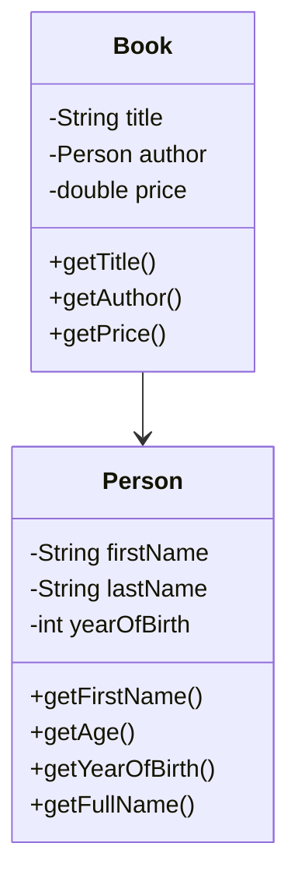

### Static v.s. Dynamic Typing

```python
x = 10
x = "hello"
```

在动态类型语言中，变量的类型是在运行时确定的。
动态类型语言的一个特点是，它们允许变量在其生命周期内引用不同类型的值。
例如，在Pytho中，你可以先将一个整数赋给变量，然后再将一个字符串赋给同一个变量，而不会引发错误。

这与静态类型语言（如Java或C++）形成对比。
在静态类型语言中，变量的类型在编译时就已确定，并且在整个程序中保持不变。

**8 Primitive Type**

- byte
- short
- int
- long
- float
- double
- char
- boolean

> Primitive Types是JAVA语言预定义的，不是对象，而是直接存储数据值

**Reference Types**

String, 以及其他所有的类名，比如Integer, Boolean, ArrayList等，都是引用类型。
引用类型的变量实际上存储的是对内存中对象的引用，而不是直接存储数据值。

### Private and Public: What Are They?

**Access Modifiers**

If a method of a class is denoted as **privite**. then that method can be called
only from other methods within that class

Making a field (method) **public** makes it accessible (callable) using an object
of this class from any method of any other class

**Information Hidding**

Expose only necessary functionality and hide others

> **Some Instructions to Fellow**
> Make all fields private
> Make all constructors public
> Make a method public ONLY if there is a clear case for calling it from outside the class,
> otherwise, make it private
> "private method"在类内部依然可以访问到和修改


### Commenting and Documentation

1. Above the class defination, explain in 1-2 sentences what this class represents
2. Write the purpose statement before each method
3. Some details deserve to mention within the method body

### UML diagram



### How to begin with writing method?

1. A purpose statement
2. Valid return type
3. A parenthesized argument list
4. A method body

**Method Signature**
```java
// 方法签名为 add(int, int)
    public int add(int a, int b) {
        return a + b;
    }
```
