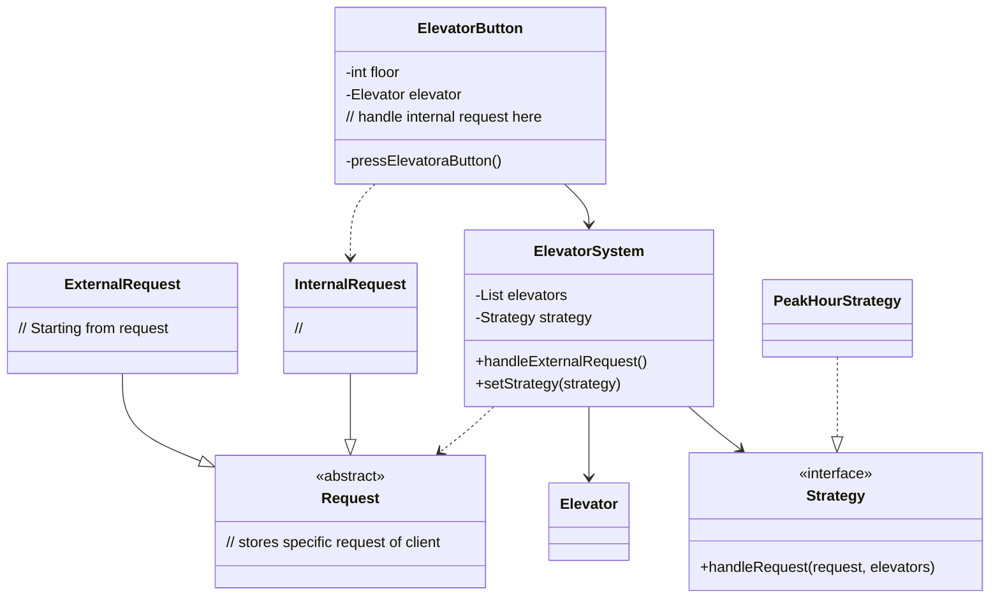

# Elevator system - OO Design
## Description
- The building currently has only one elevator, and this building has n floors
- Each elevator has three states: up, down, idle
- When the elevator moves in one direction, the reverse floor button cannot be pressed in the elevator

要实现的功能：
内部（电梯内request）等待电梯传送
外部（电梯外request）

