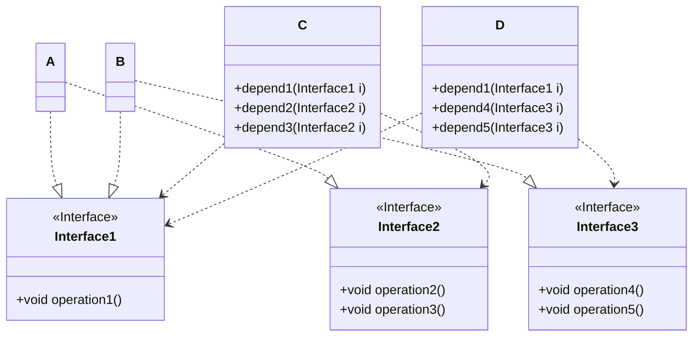

# Design Pattern

### UML REVIEW
1. Dependency
```Mermaid

```

2. Aggregation: 表示的是整体和部分的关系

```Mermaid
classDiagram
class Computer
Computer: -Mouse mouse
Computer: -Monitor monitor
Computer: -setMonitor(monitor)
Computer: -setMouse(mouse)

class Monitor

Computer o-- Monitor

class Mouse

Computer o-- Mouse
```

## 7 Principles of Design Patttern

1. 单一职责：每一个类只应该负责**一项**职责

    降低类的复杂度/ 变更带来的风险
```java
class Vehicle {
    public void roadRun() {
        // ...print
    }
    public void WaterRun() {
        // ...print
    }
    public void AirRun() {
        // ...print
    }
}
```

2. **Interface Segregation Principle** 接口隔离原则




### Dependence Inversion Principle 依赖反转
1. 高层模块不应该依赖底层模块
2. 抽象不应该依赖细节，细节应该依赖抽象
3. 中心思想是面向接口编程（以抽象为基础搭建的架构比以细节为基础的架构要稳定得多）

### 里氏替换原则
在编程时继承的时候要注意的原则

### Open Closed Principle
开闭原则（模块和函数应该对（提供方）的扩展开放，对（使用方）的修改关闭
用抽象构建框架 用实现扩展细节


## Design Pattern
- 设计模式是程序员在面对同类软件工程问题所总结出来的经验（不是代码）
- 是某类问题的通用解决方案，design pattern代表了最佳的实践

### 3 type of design pattern
1. 创建型模式：单例模式，抽象工厂模式，原型模式（解决深拷贝问题），建造者模式，工厂模式
2. 结构型模式：适配器，桥接，装饰，组合，外观，享元，代理
3. 行为型模式：模板方式，命令，观察者模式，中介者模式