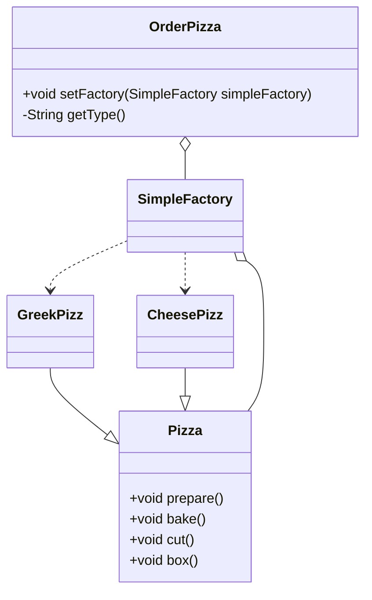

### Command Line
```
javac factory/simplefactory/order/*.java factory/simplefactory/pizza/*.java
java factory/simplefactory/order/PizzaStore
```



定义一个抽象工厂，其定义了产品的生产接口，但不负责具体的产品，将生产任务派发给不同的衍生工厂
工厂模式需要getting input from users "request是什么，order是什么 之类的

**简单工厂模式**
属于创建型，由一个工厂对象决定创建出哪一种产品类的实例，把实例化对象的行为封装起来
当我们软件开发中需要大批量的创建某类or某批对象，可以使用工厂模式