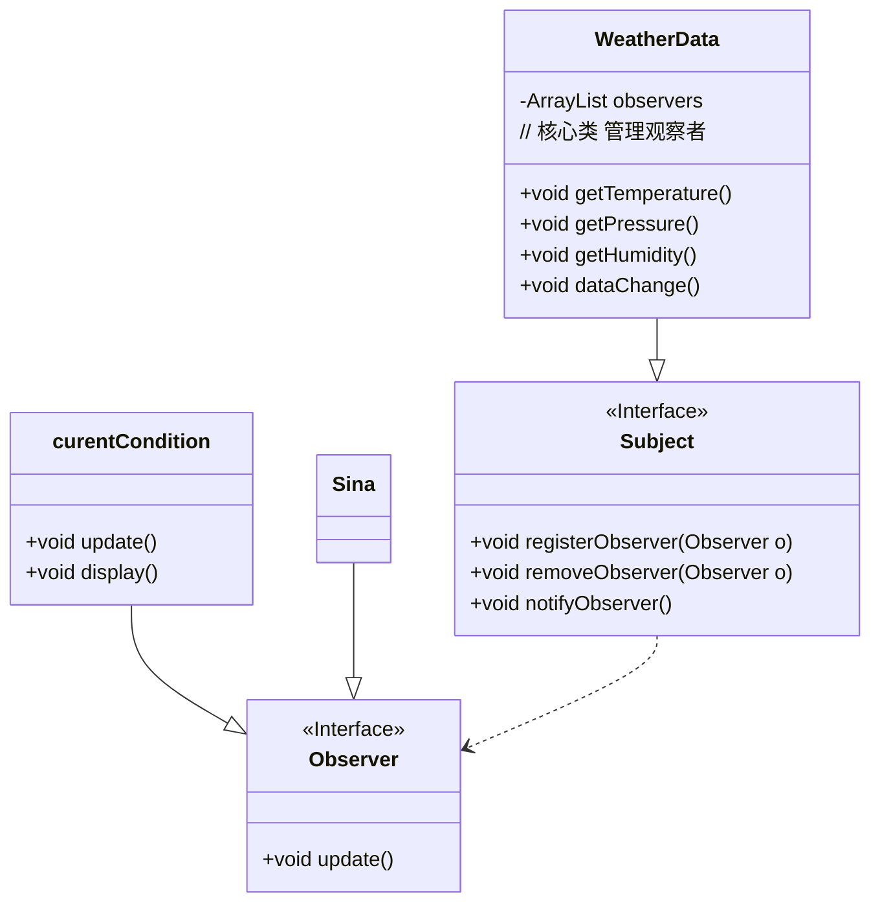

```mermaid
classDiagram
class curentCondition
curentCondition: +void update()
curentCondition: +void display()

curentCondition--|> Observer

class Sina

Sina --|> Observer

class WeatherData
WeatherData: -ArrayList observers
WeatherData: // 核心类 管理观察者
WeatherData: +void getTemperature()
WeatherData: +void getPressure()
WeatherData: +void getHumidity()
WeatherData: +void dataChange()


class Subject
<<Interface>> Subject
Subject: +void registerObserver(Observer o)
Subject: +void removeObserver(Observer o)
Subject: +void notifyObserver()

WeatherData --|> Subject

class Observer
<<Interface>> Observer
Observer: +void update()

Subject ..> Observer
```

对象之间多对一依赖的