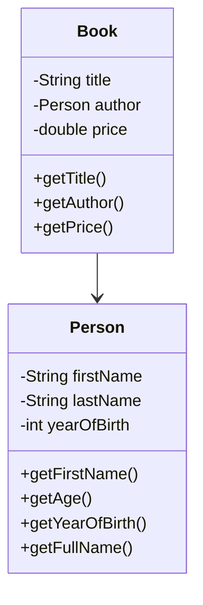

## Variable
Java程序中 +号的使用：
1. 如果两边都是数值型，做加法运算
2. 当左右两边有一方为字符串，则做拼接运算


## Static v.s. Dynamic Typing

```python
x = 10
x = "hello"
```

在动态类型语言中，变量的类型是在运行时确定的。
动态类型语言的一个特点是，它们允许变量在其生命周期内引用不同类型的值。
例如，在Python中，你可以先将一个整数赋给变量，然后再将一个字符串赋给同一个变量，而不会引发错误。

这与静态类型语言（如Java或C++）形成对比。
在静态类型语言中，变量的类型在编译时就已确定，并且在整个程序中保持不变。

## 8 Primitive Type

byte是基本存储单位，bit是最小存储单位 1 byte = 8 bits

整数类型
- byte [1] - 占用存储空间是1 byte, 范围-128~127
- short [2]
- int [4]
- long [8]

浮点类型
- float [4]
- double [8]

字符类型 - 用**单引号**引用的单个字符
- char [2]

在Java里 char的本质是一个整数 (所以char是可以参与运算的)
```java
public class Test {
    public static void main(String[] args) {
        char ch = 97;
        // 会输出97(unicode码)对应的字符
        System.out.println(ch); // 'a'
        
        char ch2 = 'a';
        System.out.println((int)c2); // 97
        System.out.println('a' + 10); // 107
        System.out.println((int)'b' + 1);
    }
}
```

- boolean [1]

在Java中不能用0非0整数代替false/true

> Primitive Types是JAVA语言预定义的，不是对象，而是直接存储数据值

**Reference Types**

String, 以及其他所有的类名，比如Integer, Boolean, ArrayList等，都是引用类型。
引用类型的变量实际上存储的是对内存中对象的引用，而不是直接存储数据值。

### 自动类型转换
1. 有多种类型混合运算时，系统首先自动将所有数据转换成容量最大的那种数据类型。
精度小的数据类型自动转换为精度大的 (如果有精度损失就会报错)
2. (byte, short) 跟char之间不会自动转换
3. (byte, short, char) 三者可以计算，在计算时首先转换为int类型
```java
short s = 12;
s = s - 9; // Wrong, trying to convert an integer to short

byte d = 10;
d = d + 11; // Wrong, trying to convert integer to byte
d = (byte)(d + 11) // Right, 使用了强制转换

short t = s + d // Wrong, byte short之间不能进行自动转换 结果是提升为int
```

## ASCII
一共规定了128个字符的编码，只占用了一个字符的后面7位

### Private and Public: What Are They?

**Access Modifiers**

If a method of a class is denoted as **privite**. then that method can be called
only from other methods within that class

Making a field (method) **public** makes it accessible (callable) using an object
of this class from any method of any other class

**Information Hidding**

Expose only necessary functionality and hide others

> **Some Instructions to Fellow**
> Make all fields private
> Make all constructors public
> Make a method public ONLY if there is a clear case for calling it from outside the class,
> otherwise, make it private
> "private method"在类内部依然可以访问到和修改


### Commenting and Documentation

1. Above the class defination, explain in 1-2 sentences what this class represents
2. Write the purpose statement before each method
3. Some details deserve to mention within the method body

### UML diagram



### How to begin with writing method?

1. A purpose statement
2. Valid return type
3. A parenthesized argument list
4. A method body

**Method Signature**
```java
// 方法签名为 add(int, int)
    public int add(int a, int b) {
        return a + b;
    }
```
